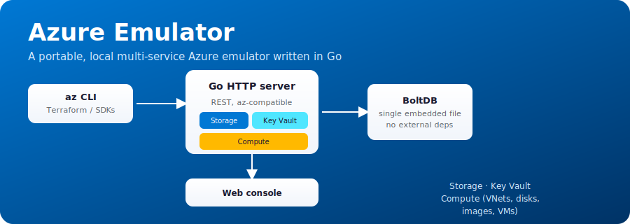

<p align="center">
  
</p>

# Azure Emulator

A local Microsoft Azure emulator written in Go. The goal is to expose REST
APIs compatible with Azure's management and data-plane endpoints (Storage,
Key Vault, Compute, and others), persist everything in a single embedded
file (BoltDB), and ship with a lightweight web console for inspecting
resources — no real Azure subscription, nothing external required.

Same idea as [gcp-emulator](../gcp-emulator), aimed at Azure instead of
GCP: a portable binary (or container) that runs the same way on Windows,
Linux, or macOS, against which you can point the real `az` CLI, the Azure
Terraform provider (`azurerm`), and the official Azure SDKs by overriding
their endpoints to `localhost`.

## Current status

Phase 1 (core server) and Phase 2 (Resource Manager basics) are done:
HTTP router with logging/recover/CORS middleware, ARM resource-ID
parsing, `api-version` validation, an async-operation (LRO) helper
matching `Azure-AsyncOperation`/`Location` polling, embedded BoltDB
persistence, a `/healthz` endpoint, fake subscriptions, and resource
group CRUD (create/update, get, list, async delete). Phase 3 (Storage)
is done: storage account ARM CRUD, blob containers/blobs, queue
storage, and table storage (all data-plane) are implemented. Phase 4
(Compute) is done: virtual networks/subnets, network interfaces,
managed disks, a static VM image catalog, and virtual machines
(create/get/delete, start/stop, all async) are implemented. Phase 5
(Key Vault) is done: vault ARM CRUD plus secrets/keys/certificates
(all data-plane, with simulated cryptographic material) are
implemented. Phase 6 (Service Bus + Cosmos DB) is done: Service Bus
namespaces (ARM, async), queues and topics/subscriptions (ARM, sync)
plus message send/peek-lock-receive/complete (data-plane); Cosmos DB
SQL API accounts (ARM, async), databases and containers (ARM, sync)
plus document CRUD (data-plane). See [ROADMAP.md](ROADMAP.md) for the
next phases.

Planned scope (subject to change as work progresses):

- **Storage**: ✅ storage accounts (ARM CRUD), ✅ blob containers/blobs
  (data-plane: create/list/get/delete containers, upload/download/list/
  delete blobs), ✅ queue storage (data-plane: create/list/get-metadata/
  delete queues, put/peek/get(dequeue)/delete messages, visibility
  timeout + pop receipts), ✅ table storage (data-plane: create/list/
  delete tables, insert/get/query/replace/merge/delete entities with a
  simplified `$filter` subset).
- **Key Vault**: ✅ vaults (ARM CRUD), ✅ secrets (data-plane CRUD), ✅ keys
  (data-plane CRUD, simulated JWK material), ✅ certificates (data-plane
  CRUD, simulated cert material — no real X.509/crypto operations).
- **Compute**: ✅ virtual networks/subnets, ✅ network interfaces, ✅ managed
  disks, ✅ static VM image catalog, ✅ virtual machines (create/get/
  delete, start/stop — all async, matching real Azure's LRO pattern).
- **Resource Manager**: ✅ resource groups, fake subscriptions, ARM-style
  long-running operations.
- **Service Bus**: ✅ namespaces (ARM CRUD, async), ✅ queues and topics/
  subscriptions (ARM CRUD, sync), ✅ message send/peek-lock-receive/
  complete (data-plane, with topic-to-subscriptions fan-out).
- **Cosmos DB**: ✅ SQL API accounts (ARM CRUD, async), ✅ databases and
  containers (ARM CRUD, sync, partition key required), ✅ document CRUD
  (data-plane: put/create/get/list/delete, simplified vs real Azure —
  plain JSON body instead of partition-key headers).
- Web console for browsing emulated resources.

## Project structure

```
cmd/azure-emulator/             entry point, wires up storage + server, listens on :10000
internal/storage/               embedded persistence (BoltDB)
internal/server/                router, middlewares, ARM parsing, LRO helper, JSON/error helpers, /healthz
internal/services/resourcemanager/  fake subscriptions + resource group CRUD
internal/services/storageaccounts/  Microsoft.Storage/storageAccounts ARM CRUD (control plane only)
internal/services/blob/         Blob containers/blobs data-plane (path-style {account}.blob/ endpoint)
internal/services/queue/        Queue storage data-plane (path-style {account}.queue/ endpoint)
internal/services/table/        Table storage data-plane (path-style {account}.table/ endpoint)
internal/services/network/      Microsoft.Network/virtualNetworks, subnets, and networkInterfaces (ARM CRUD)
internal/services/compute/      Microsoft.Compute/disks, VM image catalog, and virtualMachines (ARM CRUD)
internal/services/keyvault/     Microsoft.KeyVault/vaults (ARM CRUD) + secrets/keys/certificates (path-style {vault}.vault/ data-plane)
internal/services/servicebus/   Microsoft.ServiceBus/namespaces, queues, topics/subscriptions (ARM CRUD) + messaging (path-style {namespace}.servicebus/ data-plane)
internal/services/cosmosdb/     Microsoft.DocumentDB/databaseAccounts, sqlDatabases, containers (ARM CRUD) + documents (path-style {account}.documents/ data-plane)
docs/                            banner and other documentation assets
scripts/                         test-az-cli.sh/.ps1 — az rest smoke tests against the emulator
terraform/smoke-test/            minimal Terraform config exercising the emulator's REST endpoints
```

## Requirements

- Go 1.22+ (only needed to build from source — see "Running with Docker"
  below if you'd rather not install it)
- Azure CLI / Terraform (optional, to exercise real commands against the
  emulator once it has endpoints implemented)

> Note: this repo does not bundle the Go toolchain. If you don't have it
> installed, get it from https://go.dev/dl/ (or `winget install GoLang.Go`
> on Windows, `brew install go` on macOS, `apt install golang-go` on
> Linux).

## Running

```bash
cd azure-emulator
go mod tidy
go run ./cmd/azure-emulator
```

By default it listens on `:10000` and persists to
`.azure-emulator-data/azure-emulator.db`. `GET /healthz` confirms the
process is up. Both can be overridden with `-addr`/`-db` flags or the
`AZURE_EMULATOR_ADDR`/`AZURE_EMULATOR_DB` environment variables (the
latter is what the Docker image uses).

## Running with Docker

```bash
docker compose up --build
```